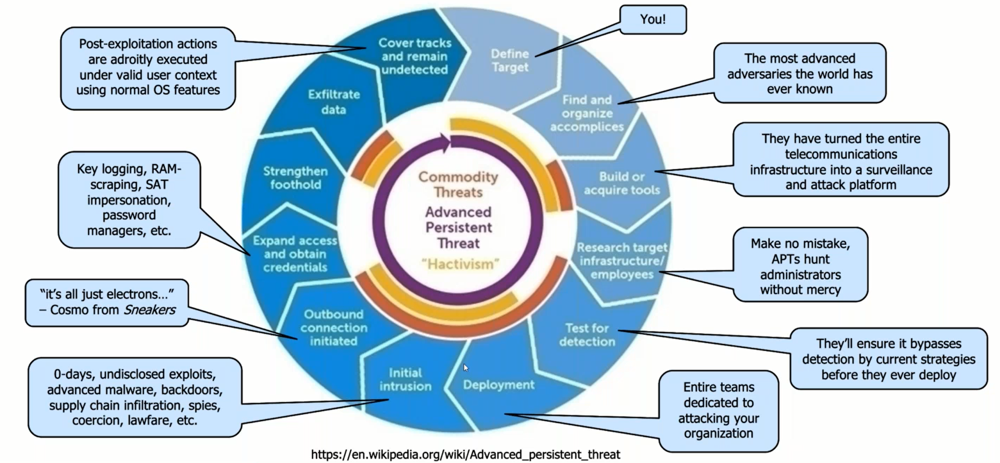
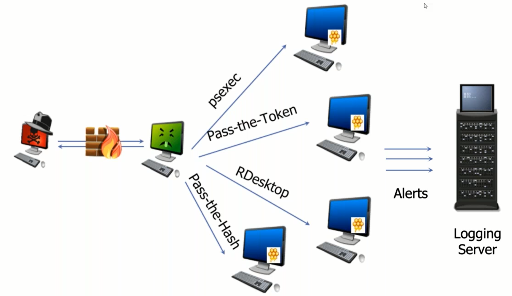

* review:
  * caldera training is built into caldera: https://github.com/mitre/caldera
    * base64 code
  * https://buckets.grayhatwarfare.com/
  * [awesomeosint](https://github.com/jivoi/awesome-osint)
  * https://detectionlab.network/introduction/
  * purple team: https://vectr.io
  * https://www.networkdefense.io/library/cyberchef-for-security-analysts-57976/200184/about/
  * https://www.activecountermeasures.com/aws-vpc-traffic-mirroring/
  * AWS: https://github.com/bhdresh/Dejavu
  * review beacon detection use cases in splunk
  * malware of the day: https://www.activecountermeasures.com/blog/
  * https://acloudguru.com/
  * can we feed corelight data to RITA?
  * https://attackevals.mitre-engenuity.org/index.html
  * deception and the legal ramifications?  entrapment
  * lateral movement detection can occur by using deception technology and alerting on things.
  * Cymmetria
  * https://www.ultimatewindowssecurity.com/securitylog/training/default.aspx
  * https://github.com/BrandonsProjects/WEFC
  * 


* lab prep
  * https://www.antisyphontraining.com/john-strand-training-lab-download-instructions/
  * download: https://introclassjs.s3.us-east-1.amazonaws.com/WINADHD01_22.7z
  * password: `adhd`
  * must disable hyper-v or "virtual machine platform"
* lab notes: https://github.com/strandjs/IntroLabs/blob/master/IntroClassFiles/navigation.md
  * Spidertrap
  * Cowrie
  * Canarytokens
  * RITA
  * Bluespawn
  * Portspoof
  * HoneyBadger
  * HoneyShare
  * HoneyUser
  * AdvancedC2
  * WebHoneypot
* course: covers the use of ADHD deception techniques and analysis.
* https://www.networkdefense.co/courses/
  * read the book


- [1. MITRE Engage framework](#1-mitre-engage-framework)
- [2. disclaimer](#2-disclaimer)
- [3. define active defense](#3-define-active-defense)
- [4. what are offensive countermeasures](#4-what-are-offensive-countermeasures)
- [5. what is cyber deception](#5-what-is-cyber-deception)
- [6. "know thy enemy"](#6-know-thy-enemy)
- [7. OODA loop](#7-ooda-loop)
  - [7.1. what do we have before attacks?](#71-what-do-we-have-before-attacks)
  - [7.2. disrupt the OODA loop](#72-disrupt-the-ooda-loop)
- [8. avoiding legal trouble](#8-avoiding-legal-trouble)
  - [8.1. warning banners](#81-warning-banners)
- [9. why these skills are critical](#9-why-these-skills-are-critical)
  - [9.1. pentester vs. attacker](#91-pentester-vs-attacker)
- [10. Detections and dwell time](#10-detections-and-dwell-time)
  - [10.1. why current strategies are not working](#101-why-current-strategies-are-not-working)
  - [10.2. quacks, hacks and geniuses](#102-quacks-hacks-and-geniuses)
  - [10.3. consider your adversaries' capabilities](#103-consider-your-adversaries-capabilities)
  - [10.4. we should not be surpised](#104-we-should-not-be-surpised)
- [11. bad guy defenses](#11-bad-guy-defenses)
  - [11.1. you will be exploited](#111-you-will-be-exploited)
    - [11.1.1. goals to defend against:](#1111-goals-to-defend-against)
  - [11.2. actual defenses](#112-actual-defenses)
    - [11.2.1. segmentation](#1121-segmentation)
    - [11.2.2. firewalls](#1122-firewalls)
    - [11.2.3. detecting an insider](#1123-detecting-an-insider)
    - [11.2.4. threat emulation](#1124-threat-emulation)
      - [11.2.4.1. difference between emulation vs. simulation](#11241-difference-between-emulation-vs-simulation)
  - [11.3. simulations](#113-simulations)
  - [11.4. get caught](#114-get-caught)
  - [11.5. key takeaways](#115-key-takeaways)
- [12. lab 1: bluespawn / atomic red team](#12-lab-1-bluespawn--atomic-red-team)
- [13. lab 2: advanced backdoors / detecting a c2 beacon](#13-lab-2-advanced-backdoors--detecting-a-c2-beacon)
  - [13.1. conclusion](#131-conclusion)
- [14. lab 3: RITA](#14-lab-3-rita)
- [15. venom & poison](#15-venom--poison)
  - [15.1. differences between venom and poison recap](#151-differences-between-venom-and-poison-recap)
  - [15.2. tarpitting, etc.](#152-tarpitting-etc)
  - [15.3. throw attackers to another page](#153-throw-attackers-to-another-page)
  - [15.4. honey DNS](#154-honey-dns)
  - [15.5. evil web servers](#155-evil-web-servers)
    - [15.5.1. tactics](#1551-tactics)
- [16. lab 4: spidertrap](#16-lab-4-spidertrap)
- [17. how do you set up tools at work](#17-how-do-you-set-up-tools-at-work)
  - [17.1. basic ADHD setup or other components](#171-basic-adhd-setup-or-other-components)
  - [17.2. proxy software](#172-proxy-software)
  - [17.3. non attributable email](#173-non-attributable-email)
  - [17.4. hosting/domain providerse](#174-hostingdomain-providerse)
  - [17.5. burner phones](#175-burner-phones)
  - [17.6. paying for it all](#176-paying-for-it-all)
  - [17.7. architectural setup](#177-architectural-setup)
- [18. honeypots](#18-honeypots)
  - [18.1. purpose](#181-purpose)
  - [18.2. use honeypots to learn about attacks](#182-use-honeypots-to-learn-about-attacks)
  - [18.3. use honeypots to learn about attackers](#183-use-honeypots-to-learn-about-attackers)
  - [18.4. why use honeypots in production?](#184-why-use-honeypots-in-production)
  - [18.5. honey users:](#185-honey-users)
    - [18.5.1. process:](#1851-process)
  - [18.6. opencanary](#186-opencanary)
  - [18.7. commercial: cymmetria maze runner](#187-commercial-cymmetria-maze-runner)
  - [18.8. honeyports](#188-honeyports)
    - [18.8.1. fail2ban](#1881-fail2ban)
- [19. lab 5: honeyports](#19-lab-5-honeyports)
  - [19.1. summary](#191-summary)
- [20. portspoof](#20-portspoof)
- [21. lab 6: portspoof](#21-lab-6-portspoof)
    - [21.0.1. implementation](#2101-implementation)
- [22. fakeroute](#22-fakeroute)
- [23. cowrie/kippo](#23-cowriekippo)
  - [23.1. what can cowrie do?](#231-what-can-cowrie-do)
- [24. lab 7: cowrie](#24-lab-7-cowrie)
- [25. artillery](#25-artillery)
- [26. weblabyrinth](#26-weblabyrinth)
- [27. applicaiton specific honeypots](#27-applicaiton-specific-honeypots)
  - [27.1. beware of OPSEC](#271-beware-of-opsec)
- [lab 8: web honeypot](#lab-8-web-honeypot)
- [legal issues](#legal-issues)
  - [concent to university network terms](#concent-to-university-network-terms)
  - [susan v. `absolute` software](#susan-v-absolute-software)
  - [public example of reflected attack](#public-example-of-reflected-attack)
  - [MSFT court order: botnet](#msft-court-order-botnet)
  - [look at your warning banner](#look-at-your-warning-banner)
  - [protecting your intellectual property](#protecting-your-intellectual-property)
  - [how can the callbacks go wrong?](#how-can-the-callbacks-go-wrong)
    - [our actual goals](#our-actual-goals)
  - [hallmarks of legality](#hallmarks-of-legality)
  - [here is data we can gather](#here-is-data-we-can-gather)
- [lab 9: honeyuser](#lab-9-honeyuser)

# 1. MITRE Engage framework


* this framework covers each idea and 
* this course focuses on "decoy artifacts and systems"

# 2. disclaimer
* the tactics covered in this source could get you into trouble
* make sure you vet some tactics with your legal team, HR, and upper mgmt
* get a warrant whenever appropriate
  * ex: continued beaconing back to our C2
* maintain high ethical and legal standards
* don't become what you're defending against
* honeypots are NOT entrapment/enticement

# 3. define active defense
* active dfense:
  * the emploiyment of limited offensive action and counterattacks to deny a contested area or position to the nemy
  * proactive, anticipatory, and reactionary actions against aggressors
  * the adversaries are already inside your gates...
* passive defense:
  * measures taken to reduce the probability of and to minimize the effects of damage caused by hostile action without the intention oftaking the initiative
  * traditional static defenses (ex: hope for the best)
* prevent | detect | response
  * prevention is ideal, but detection is a must, and detection without response is of little value...

# 4. what are offensive countermeasures
* offensive countermeasures employ offensive techniques as aggressors attack... but with a defensive posture
  * aikido focuses on redirecting and blocking opponents' attacks while taking considerable care not to harm them in the process
  * aikia practitioners respond to attacks; they do not initiate attacks
* think poison, not venom
  * poison is taken then consumerd, whereas venom is injected
  * lay traps inside your systems, but don't attack theirs
* always ensure solid legal rooting
  * proper authorization, warrant, written approval, etc.

# 5. what is cyber deception
* cyber deception is the deliverate and calculated process of deceiving attackers in an effort to wage a better defense
  * slow them down, confuse them, deceive them,... make them work harder
  * serves to significantly increase your changes tof detection
  * designed to make `Detection time + reaction time < attack time`
* cyber deception does not replace other efforts or layers of defense
* it should complement and feed the other layers
* militaries have employed deception strategies since the beginning of time.  why don't we?

# 6. "know thy enemy"


* cyber deception driven by covering deception for each of these items

# 7. OODA loop


## 7.1. what do we have before attacks?
* threat intel
* but this is crap... it's literally OSPF for a specific hack.

## 7.2. disrupt the OODA loop


# 8. avoiding legal trouble
* a few simple tips go a long way
  * don't put malware where it is publicly accessible
  * prevent collateral damage
  * make the ttackers come to you first
* use warning banners and Terms of Use
  * it's not as hard as it might seem at first
  * cortana is "ready to help you out"

## 8.1. warning banners
* it is, however, illegal to set up lethal traps for trespassers
  * and this isn't our goal anyway (remember the Aikido analogy)
* you can warn them of "evil" things in your network
* access checks, authentication verificationm, geo-location, etc.
* consult with a lawyer and get a warrant
* basically, just put up a ton of warning banners.

# 9. why these skills are critical
* attackers are getting more and more grazen
  * there is very little perceived risk on their part
  * we have rules, they don't
* you might need to figure out what an attacker is seeking
* you might need to gather info about an attacker
  * attacking from a bot-net
  * attacking through TOR or I2P

## 9.1. pentester vs. attacker
* pentesting is time boxed
* this allows the attacker to have a signicant edge and may act/enum SLOWLY and go under the radar

# 10. Detections and dwell time


* a few years ago, the dwell time was 300 days... now it's 24 days.
  * The dwell time has decreased significantly due to the NATURE OF THE ATTACK == ransomeware!
* about 70% of the detections are `external` to organizations!
* this shows that a lot of money is being spent on things that DO NOT DO ANYTHING

## 10.1. why current strategies are not working
* what were we recommending a few years ago
  * patch
  * strong passwords
  * anti-malware
  * firewall/proxies
  * etc
* what are the saying now?
  * same things, with the words "next-gen" in front!
* do you see a pattern?
  * we have calcified thought patterns
  * we generally do not think outside the box

## 10.2. quacks, hacks and geniuses
  * quacks = crazy
  * hacks = snake oil salesmen
  * geniuses = actual revolutionaries

## 10.3. consider your adversaries' capabilities
* virtually unlimited resources (via taxpayers)
* direct access to your electrons
* never-ending exploits/hackdoors
* elaborate anonymization and c2
* immunity from prosecution, etc

## 10.4. we should not be surpised
* most good testing firms are not htwarted by traditional defense
* we know what nation-states are at least as capable
* and their budgets eclipse security firms
* it's safe to say that nation-states run circles aroind most defenses

# 11. bad guy defenses
* what OSes are they likely to use and why?
* what obfuscation techniques?
* what about persistence mechanisms?
* what about c2?
* what about exfil techniques?
* spend the next few memoments and come up with a list

## 11.1. you will be exploited
* you should expect it.
* we focus far too much on prevention and note enough on detectina and response
* most current sec tech fail against these:
  * zero days
  * phishing and SE
  * advanced malwares
  * supply chain infilitration
  * gov't backdoors
* expect the worst

### 11.1.1. goals to defend against:
* pivoting
* very very high dwell time

## 11.2. actual defenses


### 11.2.1. segmentation
* start segmenting your internal networks
  * all the way down to the destktop level
  * and between subnets
* PtH attacks have worked since 1997
* PtT and security access token (SAT) impersonation have works for years, too
* make the assumption that you are goign to get compromised
* getting comproised is acceptable because it is going to happen
* what is unaccepatable is an attacker:
  * persisting for months
  * pivoting from one compromised system to the rest of the network in minutes
* consider an "infected" VLAN

### 11.2.2. firewalls
* treat the internal network as hostile
* set your internal system firewalls at the same level they would be at a coffee shop
  * all inboudn traffic should be blcoked and alerts should be generated
  * exceptions for admin networks
* segmment business units and/or org units
  * why allow SMB RPC between subnets?
  * contains the attacks even fruther than simple firewalls
* Many of the AV products have firewalls
* you can even use the built-in Windows firewall
  * if you are sadistic and desparater

### 11.2.3. detecting an insider
* if you can't detect and insider, your network is not secure
  * snowden
  * attackers using valid/existing user creds to move around a network
* can you detect a user accessing 1000s of files?
* can you detect an acct that is accessing 100s of systems?
  * if not you need to
* future targetd attacks will use far less malware than now
* would you be able to get proper attribution for an attacker who is on your system?
  * Word Web Bugs rock for this
    * https://www.blackhillsinfosec.com/tracking-attackers-with-word-web-bugs-cyber-deception/

### 11.2.4. threat emulation
* don't just think of vulns as missig patches and misconfigs on systems
* think post exploitation
* what happens after an attacker gains access to a system
* there are a number of free tools that will automate parts of this process
* currently, would take a bit of tunign and traial and error
* the collected data is invaluable

#### 11.2.4.1. difference between emulation vs. simulation
* emulation: actually run evil things
* simulation: trying to capture stuff that was created safely

## 11.3. simulations
* atomic red team: simulator
* bluespawn: analysis engine

## 11.4. get caught


* the goal is to get caught
* you can/should over lay with ATT&CK

## 11.5. key takeaways
* moving from "can we be hacked?" to "what can we detect?"
* we finally have a framework for this with mitre
* we also have a large number of tools in their infancy to help automate this
* start by finding gaps, filling them, and movign on.
* start with the framework.

# 12. lab 1: bluespawn / atomic red team
* https://github.com/strandjs/IntroLabs/blob/master/IntroClassFiles/Tools/IntroClass/bluespawn/Bluespawn.md

* bluespawn is just a local EDR
* take away process:
  * join VM to a domain
  * run as a test user
  * deploy atomicredteam
  * you want to set up your detection stack in a non-blocking mode


# 13. lab 2: advanced backdoors / detecting a c2 beacon
* https://github.com/strandjs/IntroLabs/blob/master/IntroClassFiles/Tools/IntroClass/pcap/AdvancedC2PCAPAnalysis.md
* the goal of this lab is to understand how "advanced" backdoors operate
  * beacons and obfuscation are key for a bad guy's back door to persist
* we will look at a packet cpature and decode the C2 data
* we will use ADHD VM for lab
* we will look at the packets and at RITA which will make it easier to detect
* the lab should take roughly 25 mins

1. inspect pcap

```
sudo tcpdump -nA -r covertC2.pcap | less 
```

2. inspect specific traffic

```
sudo tcpdump -r covertC2.pcap 'tcp[13] = 0x02' 
```

3. inspect things that are interseting

```
sudo tcpdump -nA -r covertC2.pcap | grep "hidden" 
```

## 13.1. conclusion
* in this, there is `__VIEWSTATE` parameters in use.  The c2 beacon is hidden within `VIEWSTATE` parameters.
  * this is very unpredictable by nature.
* to solve for this, RITA does beacon detection


# 14. lab 3: RITA

* https://github.com/strandjs/IntroLabs/blob/master/IntroClassFiles/Tools/IntroClass/RITA/RITA.md

* review items on top menu and determine beaconing via:
  * beacons (high scoring)
  * DNS (many subdomains)
* also check out https://www.activecountermeasures.com/free-tools/espy/


# 15. venom & poison

## 15.1. differences between venom and poison recap

* poison is something an entity needs to interact with
  * it is something that can be taken
  * it is inert
* venom is something that is injected
  * it is part of an attack
* active defense, when done properly, is poison
* we never attack
* make the bad guy interact with
  * word docs, java app, web page, honeyport, and honeypot


## 15.2. tarpitting, etc.
* through PHPIDS and/or PHP Tarpit, you can make attackign a website "interesting"
* first, install PHPIDS
* then, creat ea rule to all attackers to pull up Mr. Clippy
* Is it a good idea to taught attackers?
  * let's talk about that
  * see: DTE0034: system activity monitoring, collect system activity logs which can reveal adversary activity.

## 15.3. throw attackers to another page
* if you spoof version info, etc, to the outside, this can throw off vuln scanners and detections
* see DTE0004: application diversity: present the adversary with a variety of installed applications and servers

## 15.4. honey DNS
* TAKEAWAY!!!
* effecively a canary DNS, with subnet access.
* what if your DNS server pointed to a large number of non-existent systems?
* most attackers start by pulling records from a DNS server
  * AXFR if possible
* the idea is to have a large number of records pointing to unused IP address space
* then, log, alert, and possibly drop addresses that request for these systems.

## 15.5. evil web servers
* many testesrs and attackers use automated crawling
  * this helps identify pages and possible insertion points for their attacks
* maybe there is a way to attack the tools
* possibly setting up a DoS condition on the automated scanner
* you can also set up rules to alert you
* let's give this a try
* this is not something you want to do on an external webserver that you want to have crawled by google
* configure robots.txt appropriately

### 15.5.1. tactics
* randomize web names
* `robots.txt` fake entries
  * even a common word list


# 16. lab 4: spidertrap

* https://github.com/strandjs/IntroLabs/blob/master/IntroClassFiles/Tools/IntroClass/Spidertrap.md
* spidertrap generates random links, this causes many tools fail.
* you should feed spidertrap a real word list...
  * to get around this as an attacker, set max depth.

1. set up spider trap
```
cd /opt/spidertrap
# open listener on 8000 with default set of links
python3 spidertrap.py

# open listener on 8000 with specific set of links
```

2. implement: DNS record + robots.txt, then capture and detect hits for this


# 17. how do you set up tools at work
* direct connections are a no-no to an infected system
* do not connect until you have what you need for IR
* do not set it up so it is attributable to you or your company
* DTE0010: decoy account: create an account that is used for active defense purposes.


## 17.1. basic ADHD setup or other components
* consider setting up ADHD without attribution
  * preferably on a third party hosting provider
* do not set this up on your network (ever!)
* you want all the callbacks to come to a server/domain not related to your org
* set up the server via a name/email that is not a real person
  * many orgs have their employees set up the server under their personal email and name
  * this is not good at all
* register all this through a non-attributable email/paypal/domain/hosting

* TAKEAWAY!!!!
* set up a domain that;s not related to you for canary callbacks
* anonymize all of the things you can (payment, domain privacy, etc)

## 17.2. proxy software
* it is critical you use a third-party anaonymizing proxy service to connect back to your internet-facing ADHD instance, email domain registration, and paypal
* this creates another layr of protection for you and your company
* this sounds awful, but let's pretend you are a critimal
* good options for using TOR safely
  * whonix
  * tailsos
  * qubesos
* ideally set up on a third party hosted server somewhere
* VPN services are another option but may not be as anonymous
* john suggested that you use public wifi (at a restaurant, etc)

## 17.3. non attributable email
* avoid google/msft/ etc
  * let's just say privacy is not really their thing
* protonmail is all about privacy and anonymity
* all of your other accounts will use this account as the main registration and verification point
* use a very string/long passphrase (never reuse anywhere else)
* if you hae to provide an address use a famous place that has nothing to do with you or anyone associated with you in any way

## 17.4. hosting/domain providerse
* some hosting providers ar a bit crazy about how they verify who you are:
  * AWS can be strict
* ADHD
* when you create your non-attributable instance, be prepared to have to destroy it.
* provider needs to accept paypal and/or prepaid gift cards
* the previous options are getting rare and rarer
* digital ocean is a good option

## 17.5. burner phones
* burner phones are essential to confirm account details
  * services like google will require a phone to send a text to activate an account
* Phones can be purchased from just about anywhere (walmart, target, etc)
* you can also use an app like burner:
  * burnerapp.com
* now you can feel like a real spy

## 17.6. paying for it all
* do not use a personal/corp card
* purchase a cc gift card, cash

## 17.7. architectural setup


* you do NOT want your call backs to go to your infrastructure, unless the artifacts are already within your network.


# 18. honeypots
* this is an object that is intended to be intercted with by an attacker, no legitimate users
* honey all the things:
  * honeytoken
  * honeyrecord
  * honeytable
  * honeypot
  * honeynet
  * honeycred
  * honeyport
  * honetdoc
  * etc
* ideally, it should resemble something valuable to you and/or your org
* any interaction with the honey_thing_ is considered malicious and should be responded to immediately.

## 18.1. purpose
* covers:
  * DTE0013: decoy diversity
  * DTE0014: decoy network
  * DTE0015: decoy persona
  * DTE0016: decoy process
  * DTE0017: decoy system
* honeypot types:
  * research honeypots:
    * purposefully vulnerable systems
  * production honeypots
* we focus on production honeypots for:
  * identifying malicious internal systems and users
  * identifying attacks that AC and IDS miss
  * our incident-handling procedures

## 18.2. use honeypots to learn about attacks
* many teams usehoneypots to learn about how attacks work
* it can be useful as a learning tool
  * much like having a hacker ant farm
* it can be a time sinker
* management often does not see the value
* why not focus on real attacks?

## 18.3. use honeypots to learn about attackers
* how do you handle system compromises?
  * detect and clear?
  * detect and learn?
* honeypots give us grat value in understanding the attacker's skill and motivation
* dropping warez versus searching for "TOP SECRET" or credit card numbers
* what else di dthey have access to?
* DTE0034: system activity monitoring: collect system activity logs which can reveal adversary activity.

## 18.4. why use honeypots in production?
* honeypots can help you detect attacks other techniques miss
* "security through obscurity is this: no security at all"
  * let's clarify
    * `detection time + response time < attacker time`
* other security technologies have significant limitations
  * they miss most of the post-exploitation activities
  * mainly because of how we use them
  * trusted insiders are hard to detect
* honeypots are an integral part of a robust defensive architecture

## 18.5. honey users:
* we can also create accounts to trap atatackers
  * fake domain admin accounts, service acounts, etc
* we then generate alerts for when these accounts are activated
* we can also create emails for these accounts
* linkedin? fakebook? yes!
* make sure rules are created in your SIEM for these accounts being accessed
* DTE0010
* DTE0015

### 18.5.1. process:
* create accounts on linkedin and other recon 
* then create email addresses that match, etc.
* capture email and auths, and immediately ban.

## 18.6. opencanary
* a great collection of scripts to emulate a wide nubmer of honey services:
  * ftp, http, smb, ssh, telnet, etc
* the alerting is one of the more intersting aspects of opencanary
  * email, sslog, and sms
* python based scripts are super easy to use

## 18.7. commercial: cymmetria maze runner

* DTE0014

## 18.8. honeyports
* honeyports are ports that trigger an action when they are connect to:
  * blacklist
  * alert
  * fire up mr. coffee
* if they are not done correctly, there is a chance you might blacklist legitimate systems
* understand how connections work before you start implementing technical solutions
* DTE0016

### 18.8.1. fail2ban
* fail2ban monitors for auth failures in `/var/log/auth.log`
* once a thresshold of fails is reached, it will block the offending ip addr
* so easy to use, it should be installed on everything
* monitors any service that logs to `auth.log`

# 19. lab 5: honeyports
* https://github.com/strandjs/IntroLabs/blob/master/IntroClassFiles/Tools/IntroClass/HoneyPorts.md
* honeyports will automatically ban an ip via `iptables`
* instead what you could do is pipe data out to syslog or HEC.
* https://illusive.com/products-services/products/attack-detection-system/ ?

## 19.1. summary
* Just search github: https://github.com/search?q=honeyports
* honeyports give you visibility to enum
  * current tech fail at detecting attackers comm with o[pen ports over normal prots: smb, ssh, http

# 20. portspoof


* in additon to our trip wires, why not create situations to slow them down
* * generates random responses to service identification requetss
* basically, the ports that get scanned never come back the same
* DTE0013: decoy diversity: deploy a set of decoy systems with different OS and software configurations.

# 21. lab 6: portspoof

* https://github.com/strandjs/IntroLabs/blob/master/IntroClassFiles/Tools/IntroClass/Portspoof.md
* must create a re-write rule at the kernel level to redirect dst port to a single port wher `portspoof` will be 


1. conf file

```
/usr/local/etc/portspoof.conf /usr/local/etc/portspoof_signatures
```

2. redirect all ports inbound to 4444

```
iptables -t nat -A PREROUTING -p tcp -m tcp --dport 1:65535 -j REDIRECT --to-ports 4444
```

* if you set this up with a baseline of no signatures, then all nmap results will return `tcpwrapped`

3. invoke with signatures

```
portspoof -s /usr/local/etc/portspoof_signatures
```

4. flush the iptables rules

```
sudo iptables -t nat -F
```

### 21.0.1. implementation



* you can create arbitrary hostnames or wildcard DNS records, respond with the portspoof, and effectively tarpit the hell out of an attacker
* you /could/ tarpit all eternal scanners this way if you are offering on the outside.
* tryhackme: looking glass

# 22. fakeroute
* spoofs a TTL and random responses


# 23. cowrie/kippo


* cowrie is different from a simple honeyport because it allows the attacker to interact with a fake ssh service
* allows intercept and capture logins and activity by attackers
* useful for capturing passwords an attacker has, or at least what he thinks he has
* can be used for annoyance/delay, and attribution

## 23.1. what can cowrie do?
* can capture username/password combinations
* can capture commands
* detect password sprays and cred stuffing
  * cross checking against previously leaked creds, etc.
  * with real user IDs?
    * indicates targeted attack
* within the flow of cowrie, if an `exit` is issued, then cowrie spoofs an interactive session.  If the attacker isn't aware of this, then they will wind up typing commands as they woul on their own system.


# 24. lab 7: cowrie

* https://github.com/strandjs/IntroLabs/blob/master/IntroClassFiles/Tools/IntroClass/Cowrie.md

* main conf file: `/opt/cowrie/etc/cowrie.cfg`
* commands: `/opt/cowrie/honeyfs`
* users: `/opt/cowrie/etc/userdb.txt` or `/opt/cowrie/src/cowrie/core/auth.py` and populate via `/opt/cowrie/etc/userdb.example`


1. start cowrie

```
/opt/cowrie/bin/cowrie start

#verifystatus
/opt/cowrie/bin/cowrie status

#validate listener
sudo lsof -i -P | grep twistd
```

2. attempt a connection
```
ssh -p 2222 localhost
#password fails a few timesc
```

3. logs:
```
less +F /opt/cowrie/var/log/cowrie/cowrie.log
```

4. handle cowrie "give aways"
* copy `/opt/cowrie/etc/cowrie.cfg.dist` to `/opt/cowrie/etc/cowrie.cfg`

* hostname
* ip address
* ssh keys:
```
rsa_public_key = ${honeypot:state_path}/ssh_host_rsa_key.pub
rsa_private_key = ${honeypot:state_path}/ssh_host_rsa_key
dsa_public_key = ${honeypot:state_path}/ssh_host_dsa_key.pub
dsa_private_key = ${honeypot:state_path}/ssh_host_dsa_key
```

# 25. artillery
* https://github.com/BinaryDefense/artillery
* from Trusted Sec
* honeyport and file monitoring
* automatically penshoneyports for a number of widely used services:
  * 135/445
  * 1433
  * 5900
* if has the capability to generate email alerts
* possible limitations
  * the default port set is very predictable, but this can be modified
    * so modify it
* DTE0016: decoy process: execute software on a target system for the purposes of the defender

# 26. weblabyrinth


* php so you can load it in your web infrastructure
* cool features
  * tells googlebot to go away
  * see the above, it's just random on purpose
* randomize URLs and links and contents

# 27. applicaiton specific honeypots

* SCADA, etc.
* DTE0016: decoy process: execute software on a target system for the purposes of the defender

## 27.1. beware of OPSEC
* xiphosreearch.com/20156/12/09/OPSEC-For-Honeyports.htm
* also scan with nmap, as their defs also indicate honeypots

# lab 8: web honeypot

* indicator of username harvesting and password spraying.
* IDEA: given user harvesting mechanism (linkedin), try to throw off via manufacturered timing attack.
* https://github.com/strandjs/IntroLabs/blob/master/IntroClassFiles/Tools/IntroClass/webhoneypot/webhoneypot.md

1. start owa_pot

```
cd 
nohup python3 /opt/owa-honeypot/owa_pot.py &
```

2. tail the dumpass.log

```
less +F /opt/owa-honeypot/dumpass.log
```

# legal issues
* many of our assumptions are well founded
  * there is not alot of etablished case law here
* however, if you look at existing case law, you can see some interesting trends.
* THIS IS NOT ENTRAPMENT or ENTICEMENT.

## concent to university network terms
* sysadmin hacks into threatening machine
* gathered evidence used against student
* student's concent to university terms justifies sysadmin
* `US v. Heckenkamp`
  * kevin poulsen article: "court okays counter-hack of eBay hacker's computer"

## susan v. `absolute` software
* substitute teacher buys stolen laptop
* laptop has trackign software and software to spy on the thief
* embarrassing pictures are taken
* `absolute` settled out of court
* just because they do something bad to you, it does not give you the right to violate their rights.
* conclusion
  * you can not hack the hacker.
  * you can not break the law even if they are breaking the law.
  * you can attribute via IP address and geographic location

## public example of reflected attack
* in 1999, the world trade organization website had a DoS attack from the e-hippies coalition
* hosting service Conxion reflected the attack back to E-Hippies and disabled its website
  * all through the use of a mod_rewrite rule
* conxion was not prosecuted (does not imply LEGALITY)
  * it also logged 10000 unique ip addr
  * we are seeing the same type of insanity with LIOC

## MSFT court order: botnet
* civil lawsuit 2010:
  * ex parte temporary restrining order
* count issues order to suspend the domains associated with the waledec botnet
* MSFT takes "other technical measures" to degrade the botnet.

## look at your warning banner
* lhere is a lot in there about permission
* you also have a lot of tech that will check your system before it accesses the network
  * openvpn scripts
  * windows 2008 NAP
* is it possible to use this as a means to gather some info about an attacker's system?
* the warning banner should CLEARLY state exactly what we're goin to do:
  * tracking your source ip address and leverage geolocation for tracking purposes.

## protecting your intellectual property
* callbacks:
  * software updaes
* software that checks license keys
  * MSFT GA
* tracking software in phones
* we are not necessrily talking about hacking, we are talking about getting attribution or stuff we see every day

## how can the callbacks go wrong?
* mistakes or unintended consequences
* easily accessible malware
* full attacks of attacker ip addr
* crashing systems
* persistent long-term access

### our actual goals
* annoyance: delay attacker, increase complexity.
* attribution: attribute attack to attacker.
* attack

## hallmarks of legality
* Active Cyber Defense Certainty Act (ACDC)
* discuss, document, plan, consult with others
* do not hige: hiding may be interpreted as what you thiunk you are doing is "wrong"
* don't be eveil:
  * although it sems like fun, it can get you in trouble
  * and, you just became one of them
  * remember ethics, too (it is not always the same as legal)
  * don't become the people you're defending against
* striking back / hacking back is not something you should do ever ever.

## here is data we can gather
* ip address and location info
  * ads, google, apple apps, etc etc etc
* word web bugs
* geolocation
* callback pdf, xlsx
* html code to prevent/detect scraping
* honeypots
  * a very special note on entrapment
* digital code signing certs (own the CRL!)
* callback videos
  * check for a higher resolution?
* we might contact the FBI special agent covering our jurisdiction as discuss what we're planning on doing.

# lab 9: honeyuser

* https://github.com/strandjs/IntroLabs/blob/master/IntroClassFiles/Tools/IntroClass/honeyuser/honeyuser.md

1. create some users
   
2. password spray those users

3. collect logs
   
4. ???
   
5. profit.